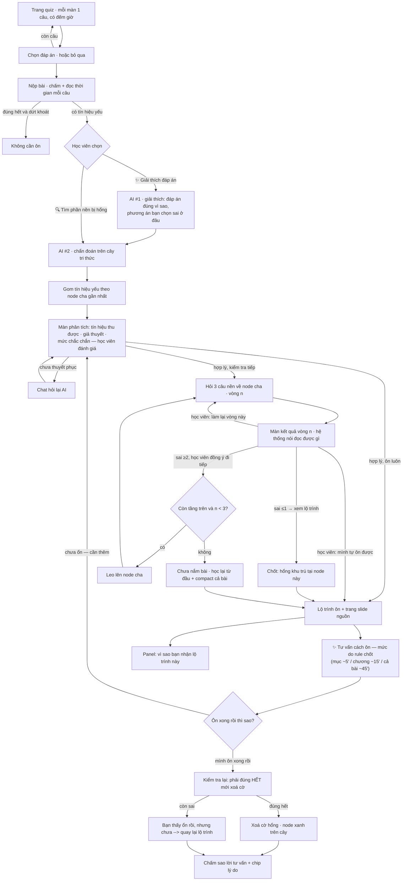
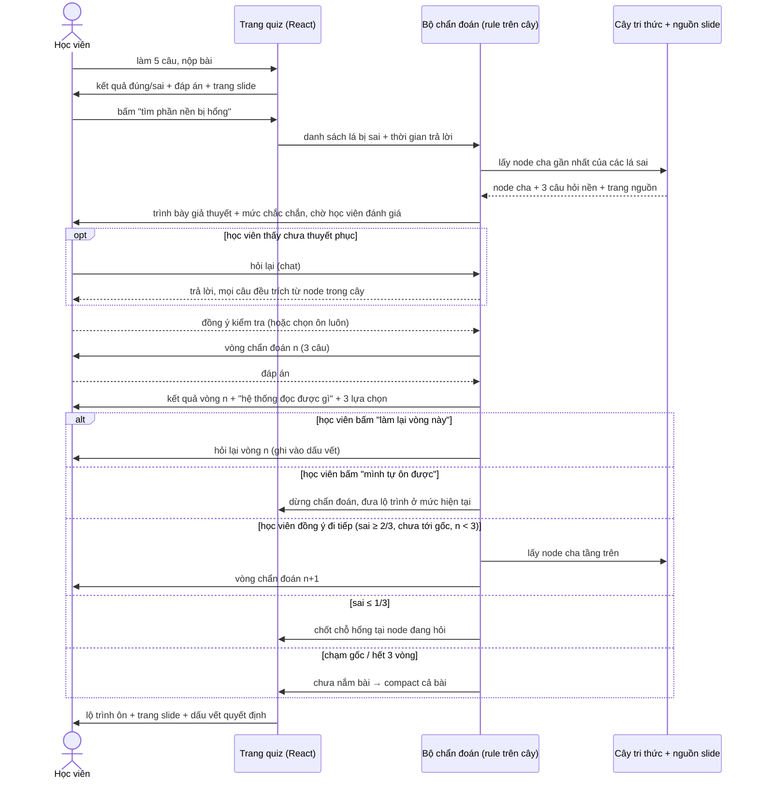

# CP2 · Luồng hoạt động — ColdBrew

Bản mock bấm được: `mockup/index.html` (React + mock data, chưa gọi AI).

## Luồng người dùng



## Sequence



## Cấu trúc dữ liệu (mock, trong `data.js`)

Nguồn thật: `data/vlearn-pack/transcript/transcript-01-clean.md` — *Day 2 (sáng) · Xác định bài toán kinh doanh cho AI*, 89 đoạn `[T01-001…089]`. Cây **do nhóm dựng tay**, 30 node.

```
root  = Day 2 (sáng) · Xác định bài toán kinh doanh cho AI   [T01-001…089]
 ├── chương      (Chương 3 · Tìm đúng vấn đề)                [T01-030…073]
 │    ├── mục    (3.1 Double Diamond)   prereq -> 1.1        [T01-049, T01-071]
 │    │    ├── lá (Phân kỳ: mở rộng góc nhìn)                [T01-071]
 │    │    └── lá (Hội tụ: gom nhóm, Five Whys)  prereq->Phân kỳ  [T01-074]
 │    └── mục    (3.2 Làm đúng cái sai)  prereq -> 1.1       [T01-060, T01-061]
 └── ...
```

Mỗi node mang `file` · `span` (mã đoạn) · `conf` (0.9 nói thẳng trong đoạn · 0.7 nhóm lại từ nhiều đoạn). Slide d2 **chưa đối chiếu trang nên không ghi số trang** — thà thiếu còn hơn trích sai.

- **Mọi node đều truy được về nguồn** — câu hỏi và nội dung ôn chỉ lấy từ node có mã đoạn, không sinh nội dung mới.
- Quiz chính hỏi ở tầng **lá**; chẩn đoán hỏi ở tầng **cha** và leo dần lên.
- `status` mỗi node: `ok` / `weak` / `probing` — hiện màu trên cây ở cột phải.

## Quy tắc chẩn đoán (rule, không phải LLM)

**Đọc tín hiệu từng câu** — đúng/sai chưa đủ, tính cả thời gian trả lời:

| Tín hiệu | Điều kiện | Xử lý |
|---|---|---|
| `ok` | đúng, ≤ 25s | nắm được |
| `slow` | đúng, > 25s | **chưa chắc** — chỉ dùng làm đầu mối khi không có câu sai nào |
| `wrong` | sai | vào diện chẩn đoán |
| `rush` | sai, < 3s | sai do bấm bừa — vẫn vào diện chẩn đoán, nhưng ghi rõ trong dấu vết |
| `skip` | bỏ trống | tính như chưa nắm, vào diện chẩn đoán |

Ngưỡng 25s/3s là **hằng số mock**, sẽ hiệu chỉnh khi có dữ liệu thật (`SLOW_SEC`, `RUSH_SEC` trong `app.jsx`).

**Leo cây:**

| Điều kiện | Hành động |
|---|---|
| Sai/bỏ trống ≤ 1/3 câu nền | Chốt: hổng nằm đúng ở node này |
| Sai/bỏ trống ≥ 2/3 câu nền | Leo lên node cha, hỏi lại |
| Chạm gốc, hoặc quá 3 vòng | Kết luận chưa nắm bài → compact cả bài, học lại |

**Hai luật chỉ có được nhờ cây thật:**

| Luật | Nội dung |
|---|---|
| **Ưu tiên tiền đề** | Node được chọn mà có cạnh `prereq` cũng đang có tín hiệu thì **xuống tiền đề trước**. Ví dụ hổng ở *3.1 Double Diamond* nhưng *1.1 Yêu cầu mơ hồ* (tiền đề) cũng sai → chẩn đoán 1.1 trước, vì sai nền thì ôn phần sau vô ích |
| **Từ chối chẩn đoán** | Toàn bộ tín hiệu là `rush` → có thể bấm bừa, hỏi lại đã. Chỉ có `slow` mà tản mát mỗi mục một câu → nói thẳng "chưa đủ căn cứ" thay vì chọn đại |

**Không chẩn đoán sau lưng học viên.** Trước vòng đầu tiên, hệ thống trình bày *tín hiệu thu được · giả thuyết · mức chắc chắn (thấp/trung bình)* rồi hỏi học viên thấy có hợp lý không: **hợp lý → kiểm tra 3 câu nền** · **hợp lý → ôn luôn, bỏ qua kiểm tra** · **chưa thuyết phục → chat hỏi lại**. Câu trả lời trong chat vẫn phải trích từ node trong cây.

**Không tự leo tầng.** Hết mỗi vòng, hệ thống dừng ở màn kết quả, nói rõ đọc được gì rồi để học viên chọn: *đi tiếp lên tầng trên* · *làm lại vòng này* · *mình tự ôn được* (dừng chẩn đoán, nhận lộ trình ở mức hiện tại kèm cảnh báo hổng có thể sâu hơn). Mọi lựa chọn đều được ghi vào dấu vết quyết định.

Quyết định chọn nhánh do rule quyết; LLM (giai đoạn sau) chỉ **diễn giải** và **sinh câu hỏi có trích dẫn** từ node, không tự thêm concept.

## Hai tính năng AI (tách rời nhau)

| | Trả lời câu hỏi gì | Đầu vào | Đầu ra | Nguồn |
|---|---|---|---|---|
| **AI #1 · Giải thích đáp án** | "Mình sai **cái gì**?" | câu hỏi + phương án học viên chọn | vì sao đáp án đúng là đúng · bẫy của phương án đã chọn | node lá của câu đó (`EXPLAIN` trong `data.js`) |
| **AI #2 · Chẩn đoán nền** | "Vì sao mình sai?" | toàn bộ tín hiệu yếu của bài quiz | vòng câu hỏi leo cây → chỗ hổng + lộ trình ôn | node cha trên cây (`PROBES`) |

Học viên chọn một trong hai sau khi nộp bài; xem giải thích xong vẫn đi chẩn đoán được.

**AI #1 có mặt ở ba mức:** nút *"✨ AI phân tích câu này"* ngay trên **từng thẻ đáp án** (cả ở màn kết quả quiz lẫn màn kết quả mỗi vòng chẩn đoán); nút *"✨ Nhận xét & giải thích đáp án vòng này"* cho **cả vòng** (nhận xét gộp: sai mấy câu, bỏ trống, bấm quá nhanh, đúng mà chậm, nên ôn hẹp hay ôn rộng); và màn *"Giải thích đáp án"* cho **cả bài quiz**. Mọi lựa chọn đều được ghi vào dấu vết quyết định.

## Đóng vòng học — không tin lời tự khai

Học viên bấm "mình ôn xong rồi" **không** làm hệ thống xoá cờ hổng. Nó mở bài **kiểm tra lại** trên đúng node đó, và lần này chặt hơn vòng chẩn đoán: **phải đúng hết** (`retestPassed` trong `engine.js`) mới xoá cờ. Lý do: cả bài toán đặt ra là học viên không biết mình hổng chỗ nào, nên tự khai là bằng chứng yếu nhất.

Hai tín hiệu tách bạch, đừng trộn:

| Tín hiệu | Trả lời câu hỏi | Ảnh hưởng |
|---|---|---|
| Qua / không qua bài kiểm tra lại | *Học viên đã nắm chưa?* | cập nhật mastery, xoá cờ, đổi màu node |
| Số sao + chip lý do | *Lời tư vấn có dùng được không?* | đo chất lượng AI, không đụng mastery |

Ba con số rút ra được khi có nhiều phiên: **% lời tư vấn ≥4 sao** · **% người tự báo "đã ổn" nhưng trượt bài kiểm tra lại** (con số chứng minh thẳng problem statement) · **% bị chê "không đúng chỗ mình hổng"** (chấm vào chất lượng chẩn đoán).

## Tư vấn ôn tập — rule chốt mức, LLM viết nội dung

| Mức | Khi nào | Khung bắt buộc | Ngân sách |
|---|---|---|---|
| Ôn một mục | chốt ở mục con | đọc lại trang X · nói lại bằng lời mình · 1 câu tự kiểm | ~5 phút |
| Ôn cả chương | chốt ở mức chương | thứ tự đi qua các mục con + vì sao thứ tự đó + tự kiểm mỗi mục | ~15 phút |
| Học lại cả bài | `restart` | 3 ý cốt lõi + lộ trình theo chương + làm lại toàn bộ quiz | ~45 phút |

`adviceLevel()` trong `engine.js` quyết định mức theo **vị trí node trên cây**, không để LLM chọn. LLM chỉ viết chữ trong khung, và mỗi ý phải gắn một trang slide.

## Hạn chế đã biết của cách hỏi hiện tại

Bộ câu hỏi nền (`PROBES`) là **tĩnh và chung cho cả node cha**: học viên sai ý *A* nhưng ba câu nền có thể đang hỏi về khía cạnh *B, C, D*. Trả lời đúng hết vì thế **chưa đủ** để kết luận nền của *A* vững.

Hướng xử lý: **sinh câu nền có điều kiện** — cho (node cha · lá bị sai · phương án đã chọn) sinh 3 câu nằm trên đường phụ thuộc dẫn tới đúng lá đó, trích từ `span` của node cha. Chi tiết và ràng buộc: `spec.md`, mục "Skill AI cần có".

## Chưa có trong bản mock

Gọi AI thật · sinh câu hỏi từ slide · learner state lưu server · giao diện giảng viên.
Resume phiên hiện dùng `localStorage` (nút "Tiếp tục phiên trước").
