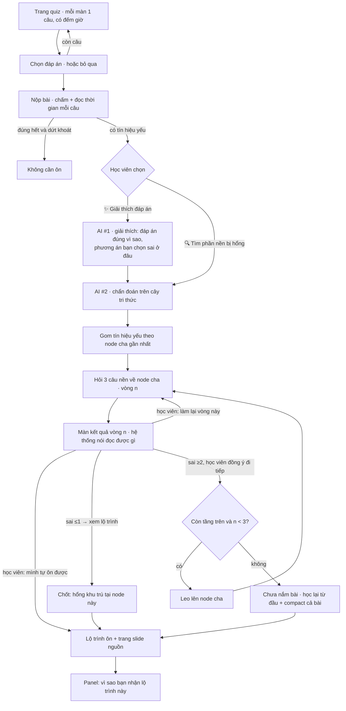
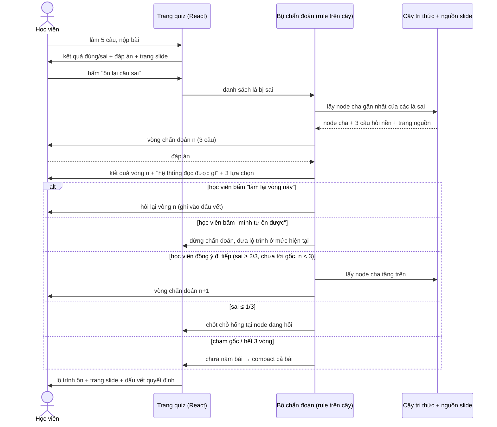

# CP2 · Luồng hoạt động — ColdBrew

Bản mock bấm được: `mockup/index.html` (React + mock data, chưa gọi AI).

## Luồng người dùng



## Sequence



## Cấu trúc dữ liệu (mock, trong `data.js`)

```
root  = tên bài giảng (Day 1 · AI & LLM Foundation)   [trang 1–29]
 ├── chương        (Chương 3 · RAG)                   [trang 20–27]
 │    ├── mục      (3.1 Embedding)                    [trang 21–22]
 │    │    ├── lá  (Văn bản được vector hoá)          [trang 21]
 │    │    └── lá  (Cosine cao = nghĩa gần)           [trang 22]
 │    └── mục      (3.2 Retrieval top-k)              [trang 25]
 └── ...
```

- **Mọi node đều có `page`** — câu hỏi và nội dung ôn chỉ được lấy từ node có nguồn, không sinh nội dung mới.
- Quiz chính hỏi ở tầng **lá**; chẩn đoán hỏi ở tầng **cha** và leo dần lên.
- `status` mỗi node: `ok` / `weak` / `probing` — hiện màu trên cây ở cột phải.

## Quy tắc chẩn đoán (rule, không phải LLM)

**Đọc tín hiệu từng câu** — đúng/sai chưa đủ, tính cả thời gian trả lời:

| Tín hiệu | Điều kiện | Xử lý |
|---|---|---|
| `ok` | đúng, ≤ 25s | nắm được |
| `slow` | đúng, > 25s | **chưa chắc** — chỉ dùng làm đầu mối khi không có câu sai nào |
| `wrong` | sai | vào diện chẩn đoán |
| `rush` | sai, < 3s | sai do bấm bừa — vẫn vào diện chẩn đoán, nhưng ghi rõ trong dấu vết |
| `skip` | bỏ trống | tính như chưa nắm, vào diện chẩn đoán |

Ngưỡng 25s/3s là **hằng số mock**, sẽ hiệu chỉnh khi có dữ liệu thật (`SLOW_SEC`, `RUSH_SEC` trong `app.jsx`).

**Leo cây:**

| Điều kiện | Hành động |
|---|---|
| Sai/bỏ trống ≤ 1/3 câu nền | Chốt: hổng nằm đúng ở node này |
| Sai/bỏ trống ≥ 2/3 câu nền | Leo lên node cha, hỏi lại |
| Chạm gốc, hoặc quá 3 vòng | Kết luận chưa nắm bài → compact cả bài, học lại |

**Không tự leo tầng.** Hết mỗi vòng, hệ thống dừng ở màn kết quả, nói rõ đọc được gì rồi để học viên chọn: *đi tiếp lên tầng trên* · *làm lại vòng này* · *mình tự ôn được* (dừng chẩn đoán, nhận lộ trình ở mức hiện tại kèm cảnh báo hổng có thể sâu hơn). Mọi lựa chọn đều được ghi vào dấu vết quyết định.

Quyết định chọn nhánh do rule quyết; LLM (giai đoạn sau) chỉ **diễn giải** và **sinh câu hỏi có trích dẫn** từ node, không tự thêm concept.

## Hai tính năng AI (tách rời nhau)

| | Trả lời câu hỏi gì | Đầu vào | Đầu ra | Nguồn |
|---|---|---|---|---|
| **AI #1 · Giải thích đáp án** | "Mình sai **cái gì**?" | câu hỏi + phương án học viên chọn | vì sao đáp án đúng là đúng · bẫy của phương án đã chọn | node lá của câu đó (`EXPLAIN` trong `data.js`) |
| **AI #2 · Chẩn đoán nền** | "Vì sao mình sai?" | toàn bộ tín hiệu yếu của bài quiz | vòng câu hỏi leo cây → chỗ hổng + lộ trình ôn | node cha trên cây (`PROBES`) |

Học viên chọn một trong hai sau khi nộp bài; xem giải thích xong vẫn đi chẩn đoán được.

**AI #1 có mặt ở ba mức:** nút *"✨ AI phân tích câu này"* ngay trên **từng thẻ đáp án** (cả ở màn kết quả quiz lẫn màn kết quả mỗi vòng chẩn đoán); nút *"✨ Nhận xét & giải thích đáp án vòng này"* *"✨ Nhận xét & giải thích đáp án vòng này"* cho **cả vòng** (nhận xét gộp: sai mấy câu, bỏ trống, bấm quá nhanh, đúng mà chậm, nên ôn hẹp hay ôn rộng); và màn *"Giải thích đáp án"* cho **cả bài quiz**. Mọi lựa chọn đều được ghi vào dấu vết quyết định.

## Chưa có trong bản mock

Gọi AI thật · sinh câu hỏi từ slide · learner state lưu server · giao diện giảng viên.
Resume phiên hiện dùng `localStorage` (nút "Tiếp tục phiên trước").
